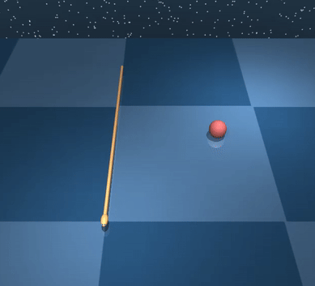
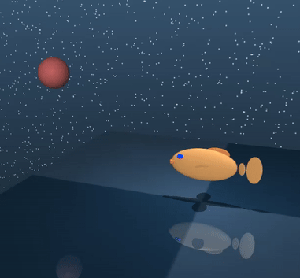
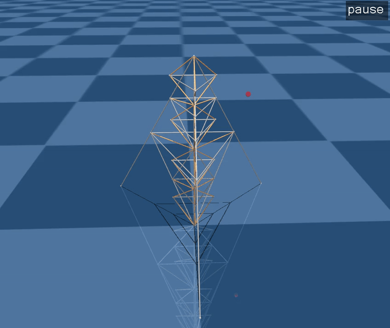
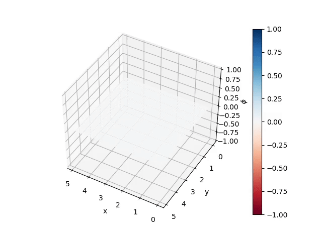

# Partially Observed Decoupled - Iterative LQR (POD-iLQR)

This repository contains the official Python implementation of the algorithms described in the paper "Information State based Reinforcement Learning for the Control of Partially Observed Nonlinear Systems". The work focuses on novel approaches for controlling partially observed nonlinear systems using reinforcement learning techniques.

## Overview

The repository implements information state-based reinforcement learning methods for partially observed nonlinear systems using Iterative Linear Quadratic Regulator (iLQR) control

## Project Structure

- `src/`: Core implementation of the algorithms
  - `main_ilqr.py`: Standard iLQR implementation
  - `main_pod_ilqr.py`: POD-based iLQR implementation
  - `ltv_sys_id.py`: Linear Time-Varying system identification
  - `arma_ltv_sys_id.py`: ARMA-based LTV system identification

- `examples/`: Example implementations and demonstrations
  - `vdp/`: Van der Pol oscillator examples
  - `pendulum/`: Pendulum system examples

## Features

- Information state feedback control using iLQR
- System identification methods for partially observed systems
- Example implementations with Van der Pol oscillator
- Comparative analysis tools and visualization

## Installation

```bash
pip install -e .
```

## Usage

Example usage for Van der Pol oscillator:

```python
# Run standard iLQR
python examples/vdp/run_vdp_ilqr.py

# Run POD-based iLQR
python examples/vdp/run_vdp_pod_ilqr.py
```

## Results

<div style="display: grid; grid-template-columns: repeat(auto-fit, minmax(400px, 1fr)); gap: 24px; margin: 20px 0;">
  <div style="text-align: center;">
    
    <p style="margin: 12px 0;"><strong>15-link Swimmer</strong><br/>34 states, 8 outputs, 14 control channels</p>
  </div>

  <div style="text-align: center;">
    
    <p style="margin: 12px 0;"><strong>Fish</strong><br/>27 states, 7 outputs, 6 control channels</p>
  </div>

  <div style="text-align: center;">
    
    <p style="margin: 12px 0;"><strong>Tensegrity Robot</strong><br/>150 states, 24 outputs, 46 control channels</p>
  </div>

  <div style="text-align: center;">
    
    <p style="margin: 12px 0;"><strong>Allan–Cahn PDE</strong><br/>2500 states, 16 outputs, 4 control channels</p>
  </div>
</div>

## Citation
If you use this code in your research, please cite:
```
@ARTICLE{TNNLS_PODiLQR,
  author={Goyal, Raman and Naveed Gul Mohamed, Mohamed and Wang, Ran and Sharma, Aayushman and Chakravorty, Suman},
  journal={IEEE Transactions on Neural Networks and Learning Systems}, 
  title={Information-State-Based Reinforcement Learning for the Control of Partially Observed Nonlinear Systems}, 
  year={2025},
  pages={1-15},
  doi={10.1109/TNNLS.2025.3593259}}

```
